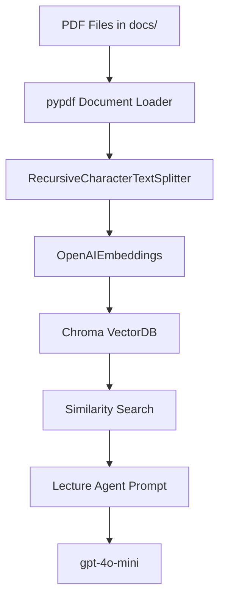

# EduPilot Agent Technical Plan (plan.md)

EduPilot Agent 시스템의 기술 아키텍처, 데이터베이스 스키마, 에이전트 설계 및 UI 구조를 명시한 상세 설계서입니다.

---

## 1. 기술 스택 (Technical Stack)

* **언어 및 런타임**: Python 3.10+
* **가상환경**: `.venv` (Python native virtual environment)
* **프론트엔드 프레임워크**: Streamlit (3단 레이아웃 구현)
* **LLM 및 프레임워크**: LangChain, LangChain-OpenAI (`gpt-4o-mini`)
* **Vector DB**: Chroma DB (로컬 저장소 `./chroma_db`)
* **관계형 데이터베이스**: SQLite3 (`edupilot.db` 로컬 파일)
* **주요 라이브러리**:
  * `langchain-community`, `chromadb`, `pypdf` (또는 `pdfplumber` 등 PDF 파싱용)
  * `python-dotenv` (환경 변수 `.env` 로드)
  * `asyncio` (비동기 병렬 처리용)

---

## 2. 데이터베이스 스키마 설계 (SQLite3)

로컬 SQLite 데이터베이스 파일(`edupilot.db`)을 사용하며, 테이블 스키마는 다음과 같습니다.

### 2.1 `students` 테이블 (학생 정보 및 상담 내역)
```sql
CREATE TABLE IF NOT EXISTS students (
    id INTEGER PRIMARY KEY AUTOINCREMENT,
    name TEXT NOT NULL,
    attendance INTEGER DEFAULT 0,
    assignment_score INTEGER DEFAULT 0,
    consulting_notes TEXT,
    career_goal TEXT,
    last_consult_date TEXT
);
```

### 2.2 `schedules` 테이블 (학사 일정 및 과제/평가 기준)
```sql
CREATE TABLE IF NOT EXISTS schedules (
    id INTEGER PRIMARY KEY AUTOINCREMENT,
    week INTEGER NOT NULL,
    topic TEXT NOT NULL,
    assignment_due TEXT,
    exam_date TEXT
);
```

### 2.3 `announcements` 테이블 (생성된 공지사항 이력)
```sql
CREATE TABLE IF NOT EXISTS announcements (
    id INTEGER PRIMARY KEY AUTOINCREMENT,
    title TEXT NOT NULL,
    content TEXT NOT NULL,
    created_at TEXT DEFAULT (datetime('now', 'localtime'))
);
```

---

## 3. RAG 강의자료 인제스션 및 검색 (Lecture Agent)



### 3.1 인제스션 플로우
1. 사용자가 Streamlit 사이드바에서 PDF를 업로드하거나 초기화 버튼 클릭 시 `docs` 폴더 내 모든 PDF 스캔.
2. `pypdf` 라이브러리로 PDF 텍스트 추출.
3. `RecursiveCharacterTextSplitter`를 사용하여 적절한 청크(chunk_size=1000, chunk_overlap=200)로 분할.
4. `OpenAIEmbeddings(model="text-embedding-3-small")`을 통해 벡터화 후 Chroma DB 에 저장.

### 3.2 검색 및 출처 표기
* 유사도 기반 검색(Similarity Search)을 사용하여 관련성 높은 상위 3~5개 청크 조회.
* 에이전트의 시스템 프롬프트에 컨텍스트를 제공할 때 **파일명**과 **페이지 번호**를 함께 전달하여, 답변 마지막에 `[출처: JS.pdf (14p)]`와 같이 명시하도록 강제함.

---

## 4. 에이전트 설계 및 협업 오케스트레이션

### 4.1 Supervisor Agent (중앙 통제 및 라우팅)
Supervisor Agent는 사용자의 입력을 받아 아래와 같은 JSON 구조로 의도를 분류하고 하위 태스크를 계획합니다.

* **입력**: "김민수 출결 확인해보고 다음 주 과제 마감일 조사해서 학부모용 공지사항 하나 만들어줘."
* **Supervisor 분석 결과 (JSON)**:
  ```json
  {
    "tasks": [
      {
        "agent": "student_agent",
        "action": "query_student_info",
        "params": {"name": "김민수"}
      },
      {
        "agent": "schedule_agent",
        "action": "query_schedule",
        "params": {"query": "다음 주 과제 마감일"}
      },
      {
        "agent": "notice_agent",
        "action": "generate_notice",
        "params": {
          "title": "학부모 안내문",
          "context_source": ["student_agent", "schedule_agent"]
        }
      }
    ]
  }
  ```

### 4.2 비동기 병렬 처리 (Async Task Parallelism)
* 독립적인 태스크(`student_agent`와 `schedule_agent`)는 `asyncio.gather`를 통해 동시에 실행합니다.
* 종속적인 태스크(`notice_agent`는 두 에이전트의 결과가 필요함)는 이전 결과들을 조합하여 순차적으로 수행합니다.
* 이를 통해 전체 API Latency를 약 40% 이상 줄입니다.

---

## 5. UI/UX 레이아웃 설계 (Streamlit)

```
+-----------------------------------------------------------------------------------+
|  EduPilot Agent - AI기반 교육 운영 보조 멀티 에이전트                               |
+------------------------------------+-----------------------------+----------------+
| (좌) 사이드바                       | (중앙) 챗봇 화면            | (우) 모니터링  |
|                                    |                             |                |
| [데이터베이스 설정]                |   [봇] 무엇을 도와드릴까요? | [최근 생성 공지]|
| * Reset & Seed DB 버튼             |                             | * 13주차 과제   |
|                                    |   [사용자] 김민수 상담 요약 | * React 안내   |
| [RAG 강의자료 업로드]              |   보여줘                    |                |
| * File Uploader                    |                             | [상담 이력 요약]|
| * Ingest Status (Chroma 상태)      |   [봇] 김민수 학생은...     | * 김민수 (06/22)|
|                                    |   (출처: student.db)        | * 이영희 (06/15)|
| [학사일정 추가]                    |                             |                |
| * Week, Topic, Due, Exam 등록      |   [채팅 입력창            ] |                |
+------------------------------------+-----------------------------+----------------+
```

* **테마**: 깔끔하고 가독성 높은 Modern Light/Dark 테마 지원 (Streamlit 기본 설정 및 Custom CSS 주입).
* **반응성**: 데이터 추가/삭제 시 우측 대시보드와 중앙 채팅 상태가 실시간으로 세션 정보에 연동되어 렌더링되도록 구현.
